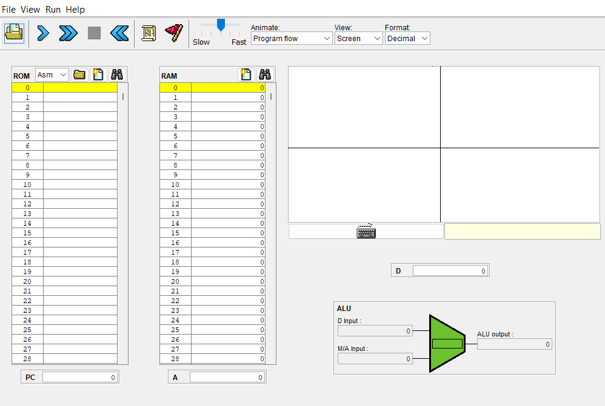

# Reto 1 - Programación en Assembler
Este es el primer reto del curso. Tienes que demostrar que entendiste el material que revisamos en clase sobre:
- Arquitectura de computadores
- Lenguaje ensamblador (Assembler)
- Uso del computador Hack (nand2tetris)

Para ello, debes desarrollar un programa en lenguaje ensamblador que realice la siguiente acción:
1. El programa debe leer el teclado de forma constante, es decir, en un bucle infinito.
2. Cuando se detecte que se presionó la tecla **T**, se debe dibujar en la pantalla una línea vertical en el centro de la pantalla y una línea horizontal en el centro de la pantalla, lo cual va a dar forma a una cruz. Para realizar la línea vertical, deben escribir el valor **1**, a partir del registro **16400** y de ahí hacia abajo. 
3. Cuando se presione la tecla **C** (clear), la pantalla se debe volver blanca totalmente.

> Observe la siguiente imagen como referencia:

# Evaluación

> La evaluación puede ser realizada en grupos de **máximo dos personas**.

## Parte 1 - Solución del problema (40%)

### Criterios de Evaluación:

Resolver el problema planteado usando lenguaje ensamblador (25 puntos)
- 15 puntos: El estudiante desarrolla un programa en ensamblador que supera los vectores de prueba propuestos por el profesor. Además, la solución se puede ejecutar en el emulador Hack y resuelve el problema planteado.
- 10 puntos: La solución se desarrolla utilizando la metodología de trabajo de control de versiones. Para esto se utilizan correctamente los comandos de Git y Github.

Descripción de la solución (15 puntos)
- 10 puntos: Utilizando el archivo README.md, realizarán una explicación clara de la solución desarrollada. El estudiante demuestra un claro entendimiento de cómo interactuar con los componentes clave del computador Hack, como la CPU, la memoria, los registros, etc. Puede borrar el contenido de este archivo y escribir su propio contenido. 
- 5 puntos: Se utilizan comentarios adecuados para explicar segmentos clave del código.

## Parte 2: Explicación del Código en Video (60 puntos)
> El video debe subirse a **Youtube** y se debe anexar un link del mismo en el archivo README.md del repositorio. **Los dos estudiantes** deben aparecer en el video, se debe mostrar tanto la pantalla como la imagen del rostro del estudiante que está hablando.

### Criterios de Evaluación:

Claridad de la Explicación (60 puntos)
- 30 puntos: El estudiante explica claramente el propósito y funcionamiento de cada segmento importante del código.
- 15 puntos: Se utiliza un lenguaje claro y conciso para explicar los conceptos técnicos.
- 15 puntos: El estudiante proporciona ejemplos concretos y detalles adicionales para respaldar las explicaciones.
